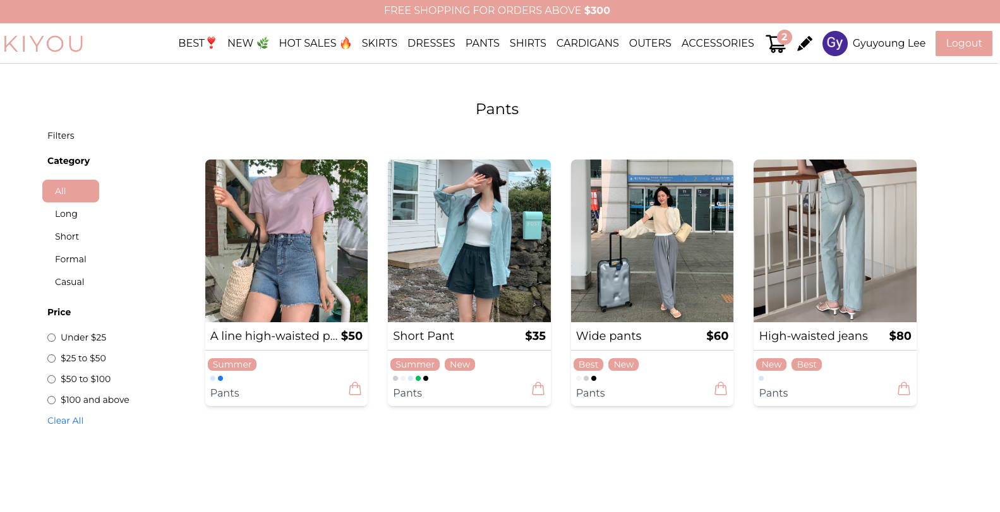
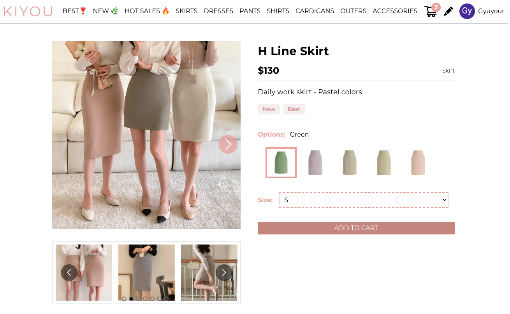
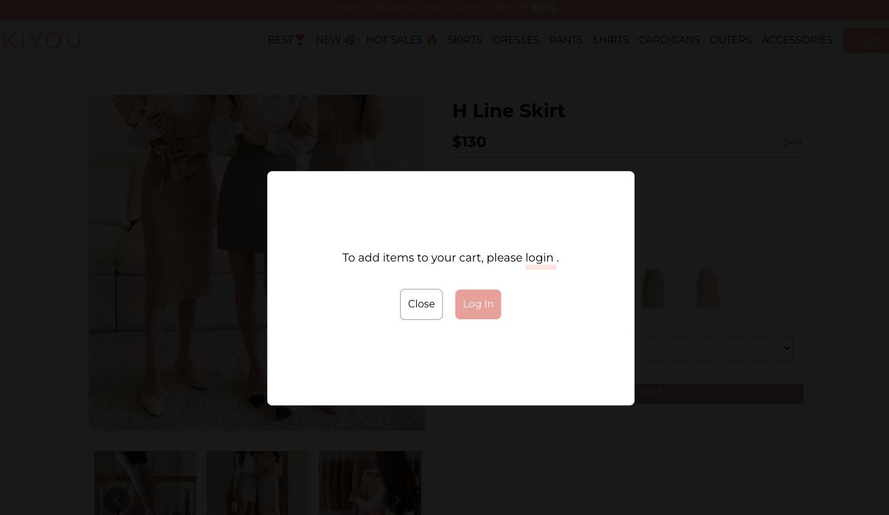
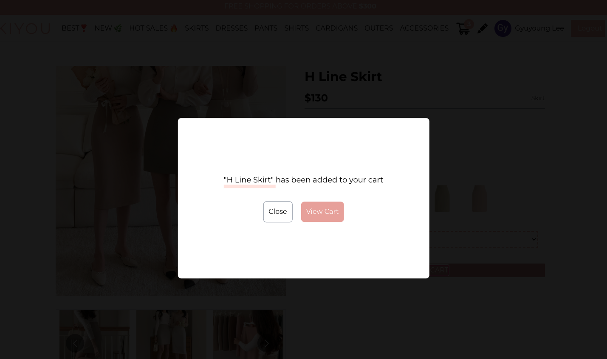
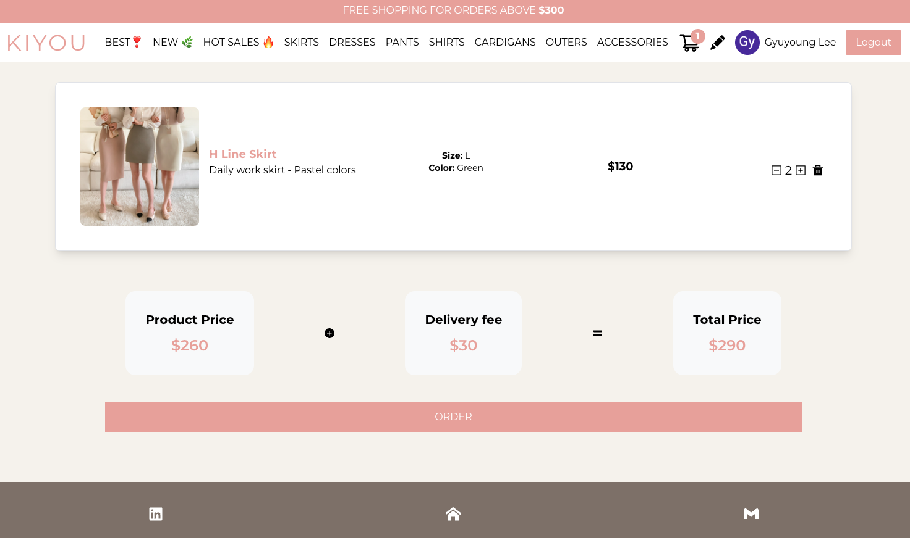
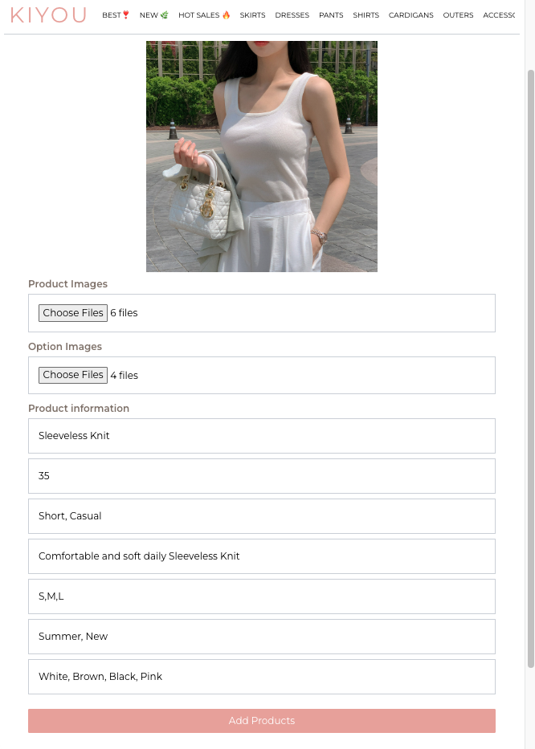
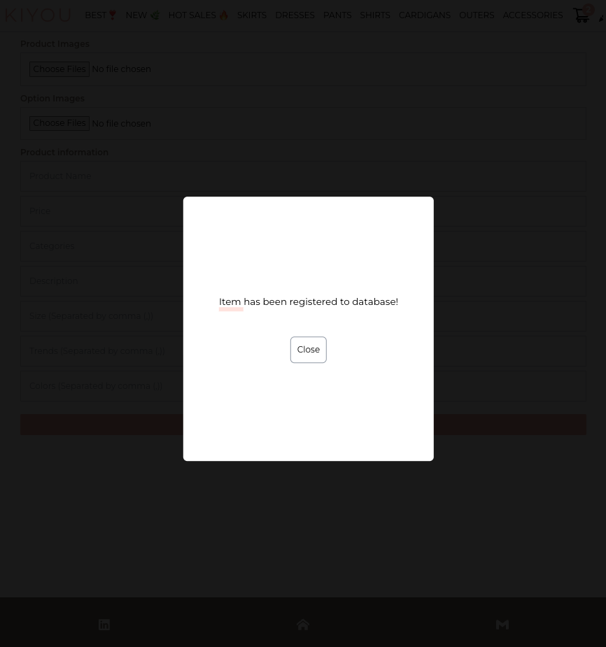
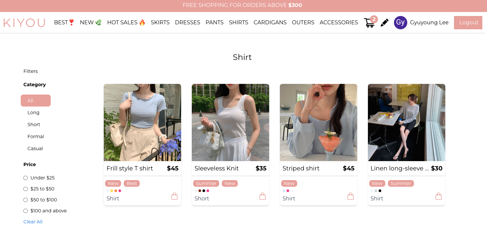

# React 기반 20대, 30대 여성들을 위한 쇼핑몰

✅ 주요 기능 : 제품 등록 (관리자), 제품 탐색, 카테고리별 가격 별 필터링, 카트에 담기(로그인 사용자), 로그인 / 로그아웃

✅ URL : https://kiyou-eshop.netlify.app/

✅ Frontend : React,TanStack Query,Tailwind

✅ Backend : Firebase Authentication

✅ Database : Firebase Realtime Database

🔍 TanStack Query (서버 상태 관리 라이브러리) 사용 이유 
- 기존 커스텀훅의 한계 보안: 여러 컴포넌트에서 동일한 커스텀 훅을 사용하여 같은 데이터를 요청할 경우, 로직은 공유되지만 데이터는 공유되지 않아 불필요한 네트워크 요청 발생 
  => 데이터 패칭, 캐싱 및 업데이트 등에 용이한 기능을 제공하여 불필요한 네트워크 요청을 줄이고 상태관리에 효울적
  => 각 데이터는 고유한 키로 저장되어, 중복 요청을 방지하고 데이터를 효율적으로 관리할 수 있음. 원하는 캐싱시간과 리패칭 조건 설정 가능
  => 네트워크 통신 실패 재시도 기능, 로딩 및 에러 상태 효율적 처리 가능 

🔍 Tailwind 사용 이유 : 
- 순수 CSS로, 많이 사용되는 디자인들을 직관적인 클래스 이름으로 제공하기 때문에 손쉽게 클래스 이름을 조립하여 원하는 디자인 구현 가능
- 다양한 플러그인과 쉽게 통합 가능하여 Tailwind에서 제공하지 않는 기능들을 손쉽게 추가 가능
- 태그와 스타일을 함께 사용하여 스타일을 빠르고 쉽게 적용 가능 

🔍 개발 시 중점 사항 : 
- 재사용 컴포넌트 생성 및 사용: 프로젝트 내에서 최대한 재사용 가능한 컴포넌트를 설계하고 사용하여 코드의 중복을 줄이고 유지보수성을 높임
- Logic과 UI의 분리: 비즈니스 로직과 사용자 인터페이스를 최대한 분리하여 코드의 가독성과 관리 효율성을 향상시킴
- Context API 사용: 로그인 상태 체크 제외하고는 전역 상태로 관리할 변수가 많지 않고 복잡하지 않아, 별도의 상태 관리 라이브러리 대신 Context API를 사용. Context API는 적절한 전역 상태 관리를 가능하게 하며, 프로젝트의 복잡성을 줄여줌

## 스크린샷 및 동영상

